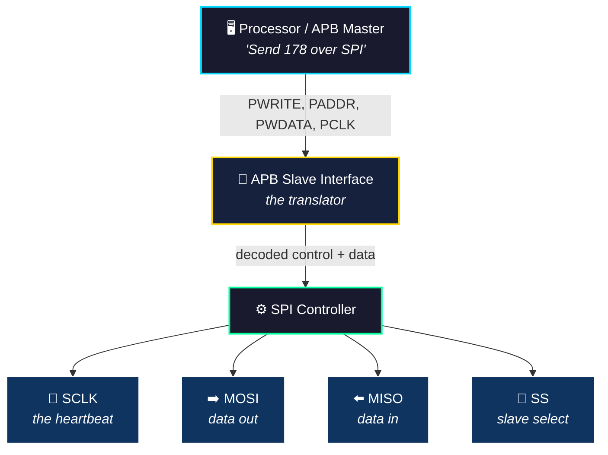
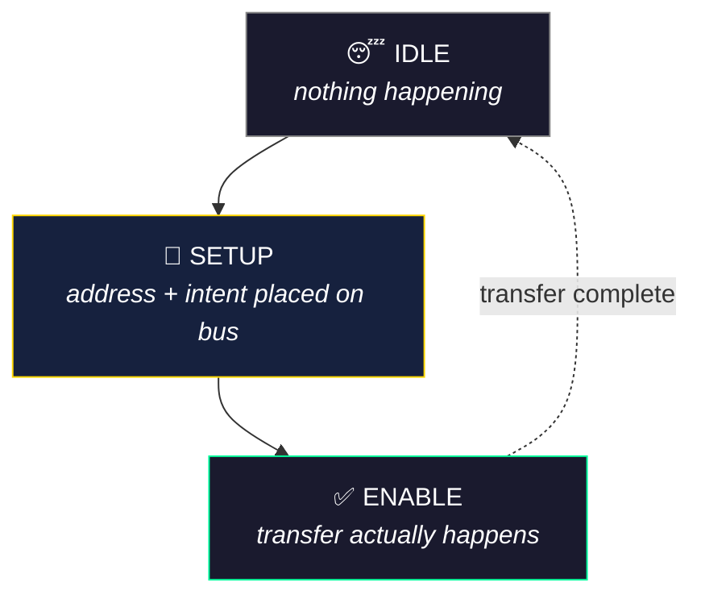

\---

layout: post
title: "How to Design an SPI Master Controller in Verilog RTL: APB, Timing, Simulation and Synthesis"
description: "Learn how to design an SPI Master Controller in synthesizable Verilog RTL, integrate APB, implement SPI timing, verify the design, debug synthesis warnings, and analyze timing, area and power."
date: 2026-09-22 18:00:00 +0530
permalink: /blog/spi-master-controller-verilog-rtl-apb/
published: false
categories:

* VLSI
* RTL
* SPI
* APB
tags:
* Verilog
* SPI Master Controller
* APB
* RTL Design
* SPI Timing
* Synthesis
* Design Compiler
* Vivado

\---

> \*\*Draft status:\*\* This article is intentionally marked `published: false` while the technical content, screenshots and explanations are being completed. Do not remove that flag until the article is ready for publication.

# How to Design an SPI Master Controller in Verilog RTL: APB, Timing, Simulation and Synthesis

## What are we building?

What happens when a processor wants to send one byte to an SPI peripheral?

Somewhere between an APB write and the first SCLK edge, that byte has to become a precisely timed stream of serial bits.

In this guide, we will build that path step by step — starting with SPI fundamentals, moving through APB-controlled register access and modular Verilog RTL, and finally taking the design through simulation, lint, synthesis, timing, area and power analysis.

The goal is not only to make an SPI waveform appear.

**The goal is to understand what the RTL is doing, why it works, and what happens to it after synthesis.**

\---

## What you will build

The final controller is organized into four functional RTL blocks plus a top-level integration module:

|RTL block|Main responsibility|
|-|-|
|`APB\_SLAVE\_INTERFACE.v`|APB transactions, configuration/status/data registers and interrupt logic|
|`BAUD\_GENERATOR.v`|Programmable SPI clock generation and timing events|
|`SPI\_SHIFT\_REGISTER.v`|Serial TX/RX datapath|
|`SPI\_SLAVE\_CONTROL\_SELECT.v`|Slave-select, transfer counting and completion control|
|`SPI\_TOP.v`|Top-level integration|

**Current implementation:** `WIDTH = 8`

\[Figure: SPI\_TOP microarchitecture — `assets/images/spi-master-controller/Architecture.png`]

\---

## What you will learn

By the end of the guide, you should be able to follow:

* How SPI communication works
* What CPOL and CPHA actually control
* How an APB transaction can configure and drive an SPI peripheral
* How to break a controller into synthesizable RTL modules
* How a programmable baud generator produces SCLK timing
* How a shift register performs SPI transmit and receive operations
* How to construct and read a verification waveform
* What RTL lint and `check\_design` are looking for
* What synthesis does to RTL
* How to interpret timing, area and power reports
* How to investigate a synthesis warning instead of assuming the RTL is broken
* What a synthesized netlist represents

\---

# 1\. SPI Fundamentals

## What is SPI?

Picture two chips that need to exchange data — but instead of shouting numbers across a room, they agree on something far more disciplined: one of them keeps a steady beat, and every single bit gets exchanged exactly on that beat. That's the entire philosophy behind **SPI (Serial Peripheral Interface)** — a synchronous serial protocol where nothing moves until the clock says so.

One device takes charge as the **master** — it's the one generating the clock (`SCLK`) and deciding when a conversation starts. Everyone else on the bus is a **slave**, quietly waiting to be picked. And "picked" is literal: the master uses a dedicated **Slave Select (SS)** line to essentially tap one specific slave on the shoulder and say *"you, and only you, are listening right now."* Every other slave on the same bus simply ignores the conversation.

What makes SPI genuinely elegant is its simplicity — no complicated addressing scheme, no arbitration, no negotiation. Just a clock, two data lines (one for each direction), and a select line. That minimalism is exactly why SPI shows up absolutely everywhere: reading temperature and pressure from sensors, talking to SD cards and flash memory chips, driving small displays, controlling ADCs/DACs, and linking microcontrollers to peripheral ICs on countless embedded boards. Anywhere you need a **fast, simple, point-to-point serial link** with no fuss — SPI is usually the first tool engineers reach for.

> **In short:** SPI trades complexity for speed and simplicity — one master, one clock, one selected listener at a time, and data moving in perfect lockstep with every tick.
### SPI signals

|Signal|Direction from master perspective|Purpose|
|-|-|-|
|`SCLK`|Output|Serial clock|
|`MOSI`|Output|Master Out, Slave In|
|`MISO`|Input|Master In, Slave Out|
|`SS/CS`|Output|Selects the target slave|

\[Figure: SPI Master and Slave Communicating  — `assets/images/spi-master-controller/master_slave.png`]


### Full-Duplex Transfer: Talking and Listening at the Same Time

Here's a fun mental exercise: try having a real conversation where you're speaking *and* listening at the exact same instant, not taking turns. Awkward for humans — but this is precisely what SPI does, effortlessly, every single clock cycle.

The **Shift Register block** (covered in detail later in this article) is where this dual act happens. While the SPI master is busy pushing a bit out to the selected slave over `MOSI`, it's simultaneously pulling a bit *in* from that same slave over `MISO` — no waiting, no turn-taking. That simultaneous two-way flow is exactly what **full-duplex** means: transmit and receive happening in the same breath.

#### Watching It Happen, Bit by Bit

Let's make this concrete with two 8-bit shift registers — `Tx_shift_reg` (sending) and `Rx_shift_reg` (receiving) — working side by side.

**Sending:** `Tx_shift_reg` holds `178` (`10110010`). Assuming MSB-first transmission, it drives one bit onto `MOSI` at every **positive edge** of `SCLK`:

| SCLK edge | 1 | 2 | 3 | 4 | 5 | 6 | 7 | 8 |
|---|---|---|---|---|---|---|---|---|
| **MOSI** | 1 | 0 | 1 | 1 | 0 | 0 | 1 | 0 |

**Receiving:** At the very same time, `Rx_shift_reg` is quietly sampling whatever the slave is sending back over `MISO`, capturing one bit on every **negative edge** of `SCLK` — let's say it happens to receive `109` (`01101101`):

| SCLK edge | 1 | 2 | 3 | 4 | 5 | 6 | 7 | 8 |
|---|---|---|---|---|---|---|---|---|
| **MISO** | 0 | 1 | 1 | 0 | 1 | 1 | 0 | 1 |

#### The Takeaway

Notice the elegant division of labor: `Tx_shift_reg` **drives** `MOSI`, `Rx_shift_reg` **samples** `MISO` — and both happen on edges of the *same* `SCLK`, just offset (posedge for driving, negedge for sampling, in this example). Neither register waits for the other to finish. By the time all 8 clock edges have ticked by, the master has sent a complete byte **and** received a completely different one — in exactly the same window of time.

> **In short:** full-duplex isn't two separate transfers happening back-to-back — it's one shared clock orchestrating two independent shift registers, each doing its own job, at the very same moment.
# 2\. SPI Clocking: CPOL and CPHA

\---

## CPOL

It decides the idle level of the SPI clock.

* `CPOL = 0`: clock idles low
* `CPOL = 1`: clock idles high

## CPHA

It decides at which edge the SPI will sample (or receive) the data.

* `CPHA = 0`: sample at first sclk edge
* `CPHA = 1`: sample at second sclk edge


### The four standard mode combinations

|SPI mode|CPOL|CPHA|
|-|-:|-:|
|Mode 0|0|0|
|Mode 1|0|1|
|Mode 2|1|0|
|Mode 3|1|1|

\[Figure: Different Modes of SPI protocol  — `assets/images/spi-master-controller/cpol_cpha.png`]

> \*\*Implementation note:\*\* In this article, when `CPOL=CPHA we are sampling (or receiving) at `posedge of sclk
and driving (or sending) at `negedge os sclk.
Similalry, for `CPOL!=CPHA we are sampling (or receiving) at `negedge of sclk
and driving (or sending) at `posedge os sclk.

So that there is a half-cycle margin between sending and receiving, this assures that the data becomes stable before the receiver samples it.

\---

# 3\. Why APB Is Connected to SPI

Picture a busy office. Inside, the CPU speaks a fast, structured corporate language — precise addresses, clean read/write cycles, everyone on the same clock. Outside the building, out in the physical world, sits an SPI peripheral: a temperature sensor, a flash chip, a display — something that only understands a completely different dialect. Serial bits, shifted one at a time, at its own negotiated speed.


These two worlds can't talk directly. The CPU doesn't know how to wiggle a MOSI line bit-by-bit, and the SPI device has no idea what an "address bus" is. Someone has to stand at the door and translate. That's exactly the job of an APB Slave Interface.


&#x20;When the processor wants to configure the SPI clock speed, or send a byte, or check if data has arrived, it doesn't talk to the SPI hardware directly. It walks up to the APB interface and says, in APB's language: "write this value to this address." The interface receives it — PWRITE\_I, PSEL\_I, PENABLE\_I, PWDATA\_I, PADDR\_I — decodes exactly which register the CPU meant, and stores it.




\---

# 4. APB Fundamentals

## The Basic APB Transfer

Every APB transaction, no matter how simple or complex the data being moved, walks through the exact same three-step dance:



*(Plain-text fallback:)*
```text
IDLE
  |
  v
SETUP
  |
  v
ENABLE
```

Think of it like knocking on a door (**SETUP**), waiting for it to actually open (**ENABLE**), and then going back to waiting for the next reason to knock (**IDLE**). Nothing is exchanged until both sides are genuinely ready — which is exactly what keeps APB simple and predictable.

## Meet the Signals

You don't need APB's entire signal list to follow this project — just these eight, each answering one small, specific question:

| Signal | What It's Really Asking |
|---|---|
| **`PSEL`** | *"Hey, is this transfer meant for you?"* — selects which slave the master wants to talk to |
| **`PENABLE`** | *"Okay, go ahead now."* — flips high in the ENABLE phase to actually carry out the transfer |
| **`PWRITE`** | *"Am I writing to you, or reading from you?"* — 1 for write, 0 for read |
| **`PADDR`** | *"Which register do you mean?"* — the address pointing at a specific register (like CR1, or the Data Register) |
| **`PWDATA`** | *"Here's the value to write."* — the data the master sends during a write |
| **`PRDATA`** | *"Here's what you asked for."* — the data the slave sends back during a read |
| **`PREADY`** | *"I need a bit more time"* (or not) — APB permits a slave to extend the ENABLE phase using PREADY. In this            implementation, PREADY_O is asserted during the ENABLE state, so the implemented transfer completes without additional wait states. |
| **`PSLVERR`** | *"Something went wrong."* — the slave's way of flagging an error back to the master |

Together, these eight signals are all APB needs to reliably move a byte in either direction, phase by predictable phase — no surprises, no ambiguity about *when* data is valid.

\[Figure: APB writing  — `assets/images/spi-master-controller/apb_writing.png`]

### APB state machine

\[Figure: APB FSM : Read/write happens in Access/Enable phase only — `assets/images/spi-master-controller/apb_fsm.png`]

\---
---# 5\. Designing the Register Interface

The controller exposes configuration, status and data through registers.

The current implementation uses:

|Register|Address|Purpose|
|-|-:|-|
|`CR1`|`0`|SPI control/configuration|
|`CR2`|`1`|Additional SPI control|
|`BR`|`2`|Baud-rate configuration|
|`STATUS`|`3`|SPI status|
|`DR`|`5`|Transmit/receive data|

\[ADD: Link to `docs/register_map.md`.]

\---
## 6.Why register-based control?


Imagine handing your SPI peripheral a to-do list instead of shouting instructions at it one at a time. That's essentially what registers are — a shared notepad where the processor jots down \*what\* to send, \*how fast\*, and \*in what format\*, and the hardware just reads off that notepad whenever it needs to know what to do next.


Think about everything the processor might want to say to the SPI controller:

\*"Send this byte." "Read what just came in." "Use this clock speed." "Flip the clock polarity." "Send MSB first, not LSB."\*


Cramming all of that into one giant signal would be chaos. Instead, the design splits these concerns cleanly across \*\*five dedicated registers\*\* — each one answering a different question.


\## The Five Registers, Each With One Job


| Register | The Question It Answers |

|---|---|

| \*\*Control Register 1\*\* | \*"What mode are we transferring in?"\* — sets `CPOL`, `CPHA` (clock polarity/phase — the four classic SPI modes), and whether data goes out LSB-first or MSB-first |

| \*\*Control Register 2\*\* | \*" Is there any mode fault ,Should SPI nap to save power?"\* — controls additional SPI behavior such as SPISWAI(power-saving behavior) and mode-fault-related configuration |

| \*\*Data Register\*\* | \*"What do you want to send — and what did you just receive?"\* — this one's a two-way mailbox: the processor drops a byte in to transmit, and picks up whatever arrived from the SPI peripheral |

| \*\*Baud Rate Register\*\* | \*"How fast should we talk?"\* — sets the SCLK frequency, the actual heartbeat of the transfer |

| \*\*Status Register\*\* | \*"Did it work?"\* — reports transfer-complete flags and mode-fault errors |


Four of these — \*\*CR1, CR2, BR, DR\*\* — are the processor's writing desk: it can both write configuration into them and read them back. The \*\*Status Register is read-only by design\*\* — the processor gets to \*check\* on progress, but it never gets to fake a "transfer complete" flag by writing one in. That asymmetry isn't an oversight; it's the whole point of a status register: it must always reflect \*ground truth\* from the hardware, never a wish from software.


\## The Flow, Bird's-Eye View


```mermaid

graph LR

&#x20;   A\["🖥️ APB Write"] --> B\["📋 CR1 / CR2 / BR / DR"]

&#x20;   B --> C\["⚙️ Internal SPI Control Logic"]

&#x20;   C -.->|status feedback| D\["📊 Status Register"]

&#x20;   D -.->|read-only| A


&#x20;   style A fill:#1a1a2e,stroke:#00d9ff,color:#fff

&#x20;   style B fill:#16213e,stroke:#ffd700,color:#fff

&#x20;   style C fill:#1a1a2e,stroke:#00ff9d,color:#fff

&#x20;   style D fill:#16213e,stroke:#ff6b6b,color:#fff

```


\## Why Bother With All This Structure?


Here's the elegant payoff: \*\*the processor never has to micromanage a single clock edge.\*\* It writes four bytes once — mode, power behavior, data, baud rate — and then simply waits, checking the Status Register whenever it's curious. Everything in between — every SCLK toggle, every bit shifted onto MOSI, every sample taken from MISO — happens entirely in hardware, driven purely by what's sitting in those registers.


# > \*\*In short:\*\* registers turn a fire-and-forget software write into a fully autonomous hardware conversation — the processor sets the rules once, and the silicon plays the whole game on its own.6. System Architecture

The controller is intentionally split into functional blocks instead of putting all logic into one module.

\[Figure: `assets/images/spi-master-controller/reg_map.png`]

### 

### Why modular RTL?


Implementing the whole SPI protocol in one big chunk of single RTL will be very complex. And also, it takes away the Reusability, Debugging , ease of verification and overall process gets inefficient.

So, a better choice is to divide each functionality into separate parts. Here We have divide the Completer SPI protocol into 4 major blocks: 

1. APB SLAVE INTERFACE:      The block that communicates with the Processor via the APB.
2. BAUD RATE GENERATOR:      It generates the heartbeat and timer signals based on which 		             the entire SPI communication takes place.

3\. SHIFT REGISTER : 	     This block is solely responsible for sending and receiving 				     data.

4\. SPI SLAVE CONTROL SELECT: It generates the Slave select logic and it determines when to 

&#x09;	             start communicating with the slave and when to end it.

&#x20;

\---

# 7\. Designing `APB\_SLAVE\_INTERFACE.v`

## Responsibility

This module acts as the bridge between the Processor and the SPI datapath via the APB transactions.

\[Figure: APB Slave interface  — `assets/images/spi-master-controller/apb_block.png`]


### Main responsibilities

* Detect APB `IDLE`, `SETUP` and `ENABLE/ACCESS`
* Decode register addresses
* Handle register writes and reads
* Store SPI configuration
* Provide transmit data
* Capture received data
* Generate status and interrupt information


### Register decoding

\[ADD: selected RTL snippet from actual source.]

### TX/RX path

```text
APB write DR
    |
    v
TX register / pending state
    |
    v
SPI transfer

SPI transfer complete
    |
    v
RX data
    |
    v
APB read
```

\[WRITE: Explain the actual implementation behavior using the RTL.]

\---

# 8\. Designing `BAUD\_GENERATOR.v`

The baud generator creates the SPI clock from `PCLK`.

The current RTL calculates:

```text
baud\_div\_1 = SPPR + 1
baud\_div\_2 = 2^(SPR + 1)

BAUD\_RATE\_DIV = baud\_div\_1 × baud\_div\_2
```

The divider then controls the SCLK timing.

## Why use a programmable divider?

\[WRITE: Explain why SPI needs a slower serial clock derived from the system clock and why programmability is useful.]

## SCLK generation

\[ADD: selected RTL snippet.]

\[ADD: timing diagram showing count, SCLK transition and timing-event pulses.]

\---

# 9\. Designing `SPI\_SHIFT\_REGISTER.v`

The shift register is the serial datapath.

### Transmit path

```text
Parallel TX data
       |
       v
 Shift register
       |
       v
      MOSI
```

### Receive path

```text
MISO
 |
 v
Shift register
 |
 v
Parallel RX data
```

Explain:

* parallel loading
* serial shifting
* MISO sampling
* MOSI output
* parameterized `WIDTH`

\[ADD: actual RTL snippets for load, shift and receive.]

\---

# 10\. Designing `SPI\_SLAVE\_CONTROL\_SELECT.v`

This block controls the transfer itself.

The high-level sequence is:

```text
SEND\_DATA
    |
    v
SS asserted
    |
    v
SCLK active
    |
    v
count transfer
    |
    v
transfer complete
    |
    v
SS inactive
    |
    v
RX available
```

The current RTL contains:

```verilog
wire \[15:0] MAX = BAUD\_RATE\_DIV\_I << log2(WIDTH);
```

For `WIDTH = 8`:

```text
log2(8) = 3
```

\[WRITE: Explain why transfer duration depends on data width and baud timing.]

\---

# 11\. Top-Level Integration: `SPI\_TOP.v`

`SPI\_TOP.v` instantiates:

```text
APB\_SLAVE\_INTERFACE
BAUD\_GENERATOR
SPI\_SHIFT\_REGISTER
SPI\_SLAVE\_CONTROL\_SELECT
```

and connects the configuration, timing, datapath and transfer-control signals.

\[ADD: top-level signal-flow explanation.]

### External interface

\[ADD: concise APB + SPI port table.]

\---

# 12\. Building the Testbench

The verification environment should answer one basic question:

> If software writes transmit data, does the controller actually produce the expected SPI transfer and return the expected received data?

The representative transaction used in this project is:

```text
APB WRITE
TX = 178
   |
   v
SPI TRANSFER
   |
   v
RX = 109
   |
   v
APB READ
RX = 109
```

\[WRITE: Explain reset/configuration sequence from actual testbench.]

\[ADD: testbench filename.]

\---

# 13\. Understanding the Final Simulation Waveform

\[Figure: `assets/images/spi-master-controller/final-top-level-waveform.png`]

The final top-level waveform contains both the bus-level and SPI-level behavior.

## APB side

Walk through:

* `PCLK`
* `PRESETn`
* `PWRITE\_I`
* `PADDR\_I`
* `PSEL\_I`
* `PENABLE\_I`
* `PREADY\_O`
* `PWDATA\_I`
* `PRDATA\_O`

## SPI control

Then follow:

* `SS\_O`
* `SCLK\_O`
* `SEND\_DATA\_I`

## Serial datapath

Finally inspect:

* `MOSI\_O`
* `MISO\_I`
* `Tx\_shift\_reg`
* `Rx\_shift\_reg`
* `RECEIVE\_DATA\_O`
* `rx\_data\_reg`

### What happens in the shown transfer?

1. The APB side writes `178` into the transmit path.
2. The controller asserts `SS`.
3. `SCLK` begins toggling.
4. The transmit shift register drives the serial MOSI data.
5. MISO is sampled during the transfer.
6. The receive shift register evolves through the observed values:
`1 → 3 → 6 → 13 → 27 → 54 → 109`
7. The transfer completes and `SS` returns inactive.
8. The received value becomes available to the APB side.
9. The APB read returns `109`.

So the complete path is:

```text
178
  |
  v
SPI serial transfer
  |
  v
109
  |
  v
APB readback
```

\[WRITE: Add exact timing observations from waveform and clarify which edges correspond to sample/send events.]

\---

# 14\. RTL Linting and Design Checks

Simulation can tell us whether our tested behavior is correct.

Lint and design checks look for suspicious or structurally problematic RTL.

Discuss examples such as:

* unused signals
* width mismatches
* undriven signals
* unconnected ports
* coding constructs that can produce unintended hardware

\[ADD: SpyGlass/lint screenshot or report excerpt.]

\---

# 15\. A Real Synthesis Debugging Moment

After synthesis, `check\_design` reported messages around:

```text
BAUD\_RATE\_DIV\[0]
```

being unconnected / not driving internal logic.

### Initial reaction

\[EDIT THIS SECTION WITH YOUR PERSONAL WORDING.]

Possible narrative:

> Everything had looked fine in simulation. Then `check\_design` produced a warning around one bit of the baud-rate divider. My first thought was: did I accidentally leave a signal disconnected?

### Trace the RTL

The divider is calculated as:

```text
BAUD\_RATE\_DIV = (SPPR + 1) × 2^(SPR + 1)
```

The key observation is:

```text
2^(SPR + 1)
```

is always even.

Therefore the resulting divider is always even:

```text
BAUD\_RATE\_DIV\[0] = 0
```

The least-significant bit is mathematically redundant, so the synthesis tool can optimize logic associated with that bit away.

### Lesson

A synthesis warning is not automatically a functional failure.

**Investigate the signal path, understand the logic, and then decide whether anything actually needs to change.**

\[WRITE: Explain the exact check\_design messages from your report and the final conclusion.]

\---

# 16\. From RTL to Gates: Synthesis

Now we move from behavioral RTL to an implementation mapped to a target technology library.

The synthesis flow used in this project was:

```text
Verilog RTL
    |
    v
Analyze
    |
    v
Elaborate
    |
    v
Link
    |
    v
Compile
    |
    v
Mapped netlist
```

Tool:

```text
Synopsys Design Compiler
T-2022.03-SP4
```

Target library:

```text
lsi\_10k.db
```

\[ADD: short explanation of what technology mapping means.]

\---

# 17\. Timing Analysis

The synthesis flow used a 20 ns clock period:

```tcl
create\_clock -name clk -period 20 \[get\_ports PCLK]
```

Reported values:

|Timing metric|Result|
|-|-:|
|Clock period|20 ns|
|Data arrival time|17.26 ns|
|Data required time|19.15 ns|
|Slack|+1.89 ns|

\[WRITE: Explain setup timing and slack in beginner-friendly terms.]

### What does +1.89 ns mean?

\[WRITE: Explain in the context of the report and the selected path.]

\---

# 18\. Area Analysis

Reported synthesis summary:

|Metric|Result|
|-|-:|
|Ports|172|
|Nets|998|
|Cells|783|
|Combinational cells|645|
|Sequential cells|134|
|Buffer/Inverter cells|74|
|Combinational area|1014|
|Non-combinational area|1190|
|Total mapped cell area|2204|

> `2204` is the mapped cell area reported by synthesis. It is not a physical chip-area result including interconnect.

\[ADD: area report screenshot.]

\---

# 19\. Power Analysis

Reported synthesis estimate:

|Metric|Result|
|-|-:|
|Cell internal power|0.0000 nW|
|Net switching power|1.0848 µW|
|Reported switching/dynamic estimate|1.0848 µW|
|Leakage|0|

The power report also contains a library characterization limitation (`PWR-799`).

Therefore:

> \*\*1.0848 µW should be presented as the available switching-power estimate from the synthesis report, not as a fully characterized physical total-power figure.\*\*

\[ADD: power report screenshot.]

\---

# 20\. What Did the RTL Become?

\[ADD: synthesized netlist diagram/screenshot.]

Explain the conceptual transformation:

```text
RTL abstraction
      |
      v
Logic optimization
      |
      v
Technology mapping
      |
      v
Synthesized gate/cell netlist
```

\[WRITE: explain what the netlist tells us and what it does not tell us.]

\---

# 21\. What I Learned

Keep this section personal and concise.

Possible points:

* Simulation is necessary, but it is not the finish line.
* Synthesis can expose implementation details that are not obvious from RTL simulation.
* Warnings should be investigated before they are “fixed.”
* Modular RTL makes complex controllers easier to reason about.
* Timing, area and power are design constraints, not just report numbers.
* Understanding the tools is part of understanding the RTL.

\[EDIT TO YOUR PERSONAL VOICE.]

\---

# 22\. Complete Design Flow

Summarize the whole project:

```text
Specification
     |
     v
SPI + APB architecture
     |
     v
Modular Verilog RTL
     |
     v
Vivado simulation
     |
     v
RTL lint / design checks
     |
     v
Design Compiler synthesis
     |
     +---- Timing
     +---- Area
     +---- Power
     |
     v
Synthesized netlist
```

\---

# 23\. Source Code and Project Files

The complete implementation is available on GitHub:

[**APB-Based SPI Master Controller**](https://github.com/ChhandakRoy/APB-based-SPI-Master-Controller)

Repository contents include the RTL, testbench material, simulation assets, lint/synthesis scripts and reports.

\---

# 24\. What's Next?

The next article in the series will move from a bus/peripheral controller to another fundamental RTL structure:

**Designing an Efficient Synthesizable FIFO in Verilog**

Later, the series will build toward:

```text
Synchronous FIFO
    ↓
Asynchronous FIFO / CDC
    ↓
AXI4-Lite → APB Bridge
    ↓
FPGA CNN Accelerators
    ↓
Latency / Throughput / BRAM / DSP Optimization
```

