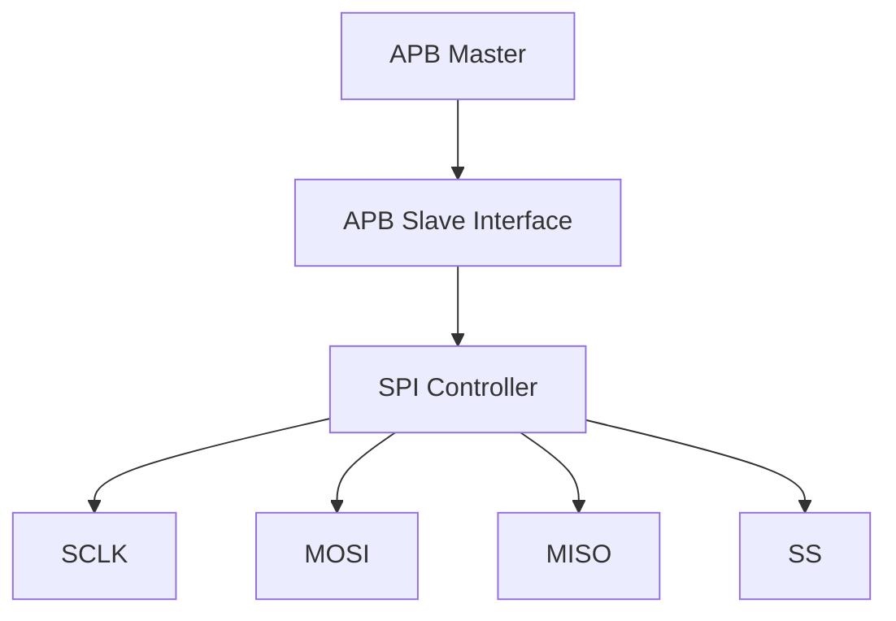
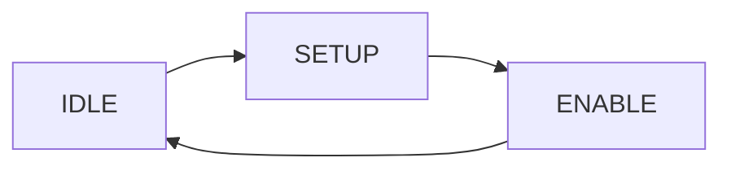

## What are we building?

What happens when a processor wants to send one byte to an SPI peripheral?

Somewhere between an APB write and the first SCLK edge, that byte has to become a precisely timed stream of serial bits.

In this guide, we will build that path step by step — starting with SPI fundamentals, moving through APB-controlled register access and modular Verilog RTL, and finally taking the design through simulation, lint, synthesis, timing, area and power analysis.

The goal is not only to make an SPI waveform appear.

**The goal is to understand what the RTL is doing, why it works, and what happens to it after synthesis.**

---

## What you will build

The final controller is organized into four functional RTL blocks plus a top-level integration module:

| RTL block | Main responsibility |
|---|---|
| `APB_SLAVE_INTERFACE.v` | APB transactions, configuration/status/data registers and interrupt logic |
| `BAUD_GENERATOR.v` | Programmable SPI clock generation and timing events |
| `SPI_SHIFT_REGISTER.v` | Serial TX/RX datapath |
| `SPI_SLAVE_CONTROL_SELECT.v` | Slave-select, transfer counting and completion control |
| `SPI_TOP.v` | Top-level integration |

**Current implementation:** `WIDTH = 8`

<figure>
  
  <figcaption><strong>Figure 1:</strong> SPI_TOP microarchitecture.</figcaption>
</figure>

---

## What you will learn

By the end of the guide, you should be able to follow:

- How SPI communication works
- What CPOL and CPHA actually control
- How an APB transaction can configure and drive an SPI peripheral
- How to break a controller into synthesizable RTL modules
- How a programmable baud generator produces SCLK timing
- How a shift register performs SPI transmit and receive operations
- How to construct and read a verification waveform
- What RTL lint and `check_design` are looking for
- What synthesis does to RTL
- How to interpret timing, area and power reports
- How to investigate a synthesis warning instead of assuming the RTL is broken
- What a synthesized netlist represents

---

## 1. SPI Fundamentals

### What is SPI?

Picture two chips that need to exchange data — but instead of shouting numbers across a room, they agree on something far more disciplined: one of them keeps a steady beat, and every bit gets exchanged on that beat. That is the basic idea behind **SPI (Serial Peripheral Interface)**, a synchronous serial communication protocol.

One device acts as the **master**. It generates the clock (`SCLK`) and decides when a transfer starts. A slave is selected using a dedicated **Slave Select (SS)** or **Chip Select (CS)** signal.

SPI intentionally keeps the interface simple. It normally uses a clock, one line from master to slave (`MOSI`), one line from slave to master (`MISO`), and a select line.

> **In short:** SPI trades a small, simple interface for a clean clocked data-transfer mechanism.

### SPI signals

| Signal | Direction from master perspective | Purpose |
|---|---|---|
| `SCLK` | Output | Serial clock |
| `MOSI` | Output | Master Out, Slave In |
| `MISO` | Input | Master In, Slave Out |
| `SS/CS` | Output | Selects the target slave |

<figure>
  
  <figcaption><strong>Figure 2:</strong> SPI master and slave communication.</figcaption>
</figure>

### Full-Duplex Transfer: Talking and Listening at the Same Time

Here's a useful mental model: SPI can transmit and receive on the same clocked transfer. While the master is sending a bit over `MOSI`, it can simultaneously sample a bit coming back over `MISO`.

The **Shift Register block** is where this dual activity happens. One path shifts transmit data toward `MOSI`, while another accumulates bits sampled from `MISO`.

#### Watching It Happen, Bit by Bit

Let's make this concrete with two 8-bit shift registers — `Tx_shift_reg` and `Rx_shift_reg`.

**Sending:** `Tx_shift_reg` holds `178` (`10110010`). The representative example below assumes MSB-first transmission and shows the bit sequence being driven:

| SCLK edge | 1 | 2 | 3 | 4 | 5 | 6 | 7 | 8 |
|---|---:|---:|---:|---:|---:|---:|---:|---:|
| **MOSI** | 1 | 0 | 1 | 1 | 0 | 0 | 1 | 0 |

**Receiving:** At the same time, `Rx_shift_reg` samples the slave's `MISO` bits. For the representative waveform used later, the received byte is `109` (`01101101`):

| SCLK edge | 1 | 2 | 3 | 4 | 5 | 6 | 7 | 8 |
|---|---:|---:|---:|---:|---:|---:|---:|---:|
| **MISO** | 0 | 1 | 1 | 0 | 1 | 1 | 0 | 1 |

The important point is that transmit and receive are part of the same SPI clocked transfer.

> **In short:** full-duplex SPI uses one shared clock to coordinate simultaneous transmit and receive datapaths.

---

## 2. SPI Clocking: CPOL and CPHA

### CPOL

**CPOL (Clock Polarity)** determines the idle level of SCLK.

- `CPOL = 0`: SCLK idles low
- `CPOL = 1`: SCLK idles high

### CPHA

**CPHA (Clock Phase)** determines which active edge is used for sampling relative to the SPI transfer's first and second active edges.

- `CPHA = 0`: sample on the first active edge
- `CPHA = 1`: sample on the second active edge

### The four standard mode combinations

| SPI mode | CPOL | CPHA |
|---|---:|---:|
| Mode 0 | 0 | 0 |
| Mode 1 | 0 | 1 |
| Mode 2 | 1 | 0 |
| Mode 3 | 1 | 1 |

<figure>
  
  <figcaption><strong>Figure 3:</strong> CPOL/CPHA combinations for the four standard SPI modes.</figcaption>
</figure>

### How CPOL and CPHA are used in this RTL

The exact edge-event behavior is implemented by the combination of `BAUD_GENERATOR.v` and `SPI_SHIFT_REGISTER.v`.

In the current RTL, the `CPOL`/`CPHA` combination selects which generated timing event is used for receiving and which is used for sending. When `CPOL` and `CPHA` are equal, the receive/send event assignment is different from the case where they are unequal.

The important design idea is that the transmit and receive events are separated in time so the driven data has time to become stable before it is sampled.

---

## 3. Why APB Is Connected to SPI

Picture a busy office. Inside, the processor speaks a structured bus language with addresses and read/write transactions. Outside, an SPI peripheral communicates using clocked serial bits.

These two interfaces serve different purposes. APB gives software a convenient way to configure and control a peripheral. SPI provides the actual serial communication link.

When the processor wants to configure the SPI clock speed, send a byte, or read received data, it writes to or reads from registers exposed by the APB slave interface.



The APB slave interface is therefore the bridge between software-visible control and the SPI datapath.

---

## 4. APB Fundamentals

### The Basic APB Transfer

Every APB transaction follows a simple phase sequence:



**IDLE** means no APB transfer is currently taking place.

During **SETUP**, the master selects the peripheral and presents the address and transaction information.

During **ENABLE**, the transfer is completed. In this implementation, `PREADY_O` is asserted during the ENABLE state, so the controller completes the transfer without adding wait states.

### Meet the Signals

You do not need the entire APB specification to understand this project. These signals are the important ones here:

| Signal | Purpose |
|---|---|
| `PSEL` | Selects the APB slave |
| `PENABLE` | Marks the ENABLE phase |
| `PWRITE` | Selects write (`1`) or read (`0`) |
| `PADDR` | Selects the target register |
| `PWDATA` | Write data from the APB master |
| `PRDATA` | Read data returned by the APB slave |
| `PREADY` | Indicates that the transfer can complete |
| `PSLVERR` | Reports the implemented APB error condition |

Together, these signals define the software-facing transaction side of the controller.

<figure>
  
  <figcaption><strong>Figure 4:</strong> APB write transaction used to access the SPI controller.</figcaption>
</figure>

### APB state machine

<figure>
  
  <figcaption><strong>Figure 5:</strong> APB FSM showing the transfer phases.</figcaption>
</figure>

---

## 5. Designing the Register Interface

The controller exposes configuration, status and data through registers.

### Register map

| Register | Address | Purpose |
|---|---:|---|
| `CR1` | `0` | SPI control/configuration |
| `CR2` | `1` | Additional SPI control |
| `BR` | `2` | Baud-rate configuration |
| `STATUS` | `3` | SPI status |
| `DR` | `5` | Transmit/receive data |


### Why register-based control?

Imagine handing the SPI peripheral a to-do list instead of shouting instructions at it one at a time. The registers provide a shared software-visible interface where the processor specifies what to send, how the SPI should operate, and what status it wants to inspect.

The current implementation uses five register locations, each with a specific job.

| Register | The question it answers |
|---|---|
| **Control Register 1** | What SPI mode and bit order should be used? This includes fields such as `MSTR`, `CPOL`, `CPHA` and `LSBFE`. |
| **Control Register 2** | Should the SPI wait according to `SPISWAI`, and how should additional control such as mode-fault-related configuration behave? |
| **Baud Rate Register** | How fast should SCLK run? |
| **Status Register** | Has a transfer completed, and is there a mode-fault condition? |
| **Data Register** | What byte should be transmitted, and what byte has been received? |

The status information is generated by hardware rather than being freely written by software, which allows the processor to observe transfer state.

### The flow, bird's-eye view


The processor does not have to manually control individual SCLK edges. It configures the controller through registers, and the hardware performs the serial transfer. So, the whole work is distributed efficiently between the processor and the SPI peripheral.

---

## 6. System Architecture

<figure>
  
  <figcaption><strong>Figure 6:</strong> System architecture of the complete SPI master controller.</figcaption>
</figure>

### Why modular RTL?

Implementing the whole SPI protocol in a single block would make the design harder to understand, debug, verify and reuse.

A modular design separates the responsibilities:

1. **APB Slave Interface** — communicates with the processor through APB, stores configuration and data, and provides status/interrupt information.
2. **Baud Rate Generator** — creates SCLK timing and the event pulses used by the serial datapath.
3. **Shift Register** — handles transmit and receive data shifting.
4. **SPI Slave Control Select** — generates slave-select timing, counts the transfer and indicates completion.

This separation also makes it easier to inspect each block independently in simulation and synthesis.

---

## 7. Designing `APB SLAVE INTERFACE`

This module acts as the software-facing control block between the APB transaction interface and the SPI datapath.

<figure>
  
  <figcaption><strong>Figure 7:</strong> APB slave interface block.</figcaption>
</figure>

### Behavioral functionalities :

- Detect APB `IDLE`, `SETUP` and `ENABLE` phases
- Generate `PREADY_O`
- Generate the implemented `PSLVERR_O` condition
- Decode register addresses
- Handle register write and read operations
- Run SPI FSM and Store SPI configuration
- Provide transmit data to Shift register block
- Capture received data from Shift register block
- Generate status and interrupt information for the processor

### Understanding the Behavioral Simulation

<figure>
  
  <figcaption><strong>Figure 8:</strong> APB register read and write transactions.</figcaption>
</figure>

The behavioral simulation lets us follow how an APB transaction is converted into configuration and data inside the SPI controller.

The important sequence is:

- **APB writes the SPI configuration registers one by one.**  
  The processor first writes the required control and baud-rate settings through the APB interface.

- **The transmit data register is written with `178`.**  
  In the simulation, the APB master writes `178` (`10110010`) to the Data Register address (`PADDR_I = 5`).

- **Transmit data and receive data are handled separately internally.**  
  Although they are accessed through the same APB Data Register address, the implementation uses separate internal registers: `tx_data_reg` for transmitted data and `rx_data_reg` for received data. The former is written by the APB interface, while the latter is updated after an SPI transfer.

- **Writing `tx_data_reg` clears `SPTEF` and sets `dr_pending`.**  
  `SPTEF` indicates that the transmit data register is empty. Once the processor writes new data, `SPTEF` becomes `0`, while `dr_pending` becomes `1`. This tells the controller that new transmit data is waiting to be transferred.

- **The controller waits until the SPI datapath is ready to accept the new data.**  
  When the APB interface is no longer writing the transmit register and `SS_I` is high (meaning that no SPI transfer is currently active), the controller generates the `SEND_DATA_O` pulse.

- **The transmit data is then passed to the Shift Register block.**  
  During this transfer handoff, `tx_data_reg` is presented through `MOSI_DATA_O`, while `SEND_DATA_O` indicates that the Shift Register should load the new transmit data.

- **The actual serial transmission happens inside the Shift Register block.**  
  At this point, the APB interface has finished its job. The Shift Register takes the parallel transmit data and converts it into the serial SPI stream.

- **The receive path works in the opposite direction.**  
  After the SPI transfer completes, the data captured by the Shift Register is transferred into `rx_data_reg`.

- **In the shown simulation, `rx_data_reg` becomes `109`.**  
  The received value is then available to the APB interface for software to read.

- **Finally, the APB master reads the Data Register.**  
  At the highlighted point in the waveform, `PADDR_I = 5` and `PRDATA_O = 109`, showing that the received SPI data has been successfully returned through the APB interface.

At this stage, we have only followed the **control and data handoff** between APB and the SPI datapath. The exact process of loading the transmit data, shifting individual bits, sampling `MISO`, and constructing the received value will become much clearer when we examine the **`SPI_SHIFT_REGISTER`** block in the next section. The high-level data path is:

```text
APB write DR
      |
      v
Transmit data / pending state
      |
      v
SPI transfer
      |
      v
Received serial data
      |
      v
Receive register
      |
      v
APB read DR
```

A data-register write creates pending transmit activity. Once the SPI control logic allows the transfer to start, the transmit data is passed into the SPI datapath. After the serial transfer completes, received data is available for APB readback.

---

## 8. Designing `BAUD_GENERATOR`

The `BAUD_GENERATOR` is the timing engine of the SPI datapath.

Its job is not simply to divide `PCLK`. It converts the programmable baud-rate settings into the SPI clock and generates the timing events that tell the Shift Register when to transmit and when to sample data.

<figure>
  
  <figcaption><strong>Figure 10:</strong> Baud Generator interface.</figcaption>
</figure>

### Behavioral functionalities

The Baud Generator performs three closely related tasks:

- **Calculate the SPI baud-rate divider.**  
  The programmed `SPPR` and `SPR` values determine the active baud-rate division:

  ```text
  BAUD_RATE_DIV = (SPPR + 1) × 2^(SPR + 1)
  ```

  This divider determines the relationship between the system clock `PCLK` and the generated SPI clock:

  ```text
  SCLK frequency = PCLK / BAUD_RATE_DIV
  ```

- **Generate the SPI clock.**  
  An internal counter counts `PCLK` cycles and toggles `SCLK` whenever the half-period count is reached. Since the clock toggles twice during one complete SCLK period, the resulting SCLK period corresponds to `BAUD_RATE_DIV` system-clock cycles.

- **Generate timing events for the Shift Register.**  
  The Shift Register does not independently generate or derive the SPI timing. Instead, the Baud Generator provides four event pulses corresponding to the possible transmit and receive edges:

  1. `MISO_RCV_SCLKP_O` — receive/sample event associated with the rising edge of `SCLK`
  2. `MISO_RCV_SCLKN_O` — receive/sample event associated with the falling edge of `SCLK`
  3. `MOSI_SEND_SCLKP_O` — transmit/update event associated with the rising edge of `SCLK`
  4. `MOSI_SEND_SCLKN_O` — transmit/update event associated with the falling edge of `SCLK`

  Which pair is active depends on the configured `CPOL` and `CPHA` values.

> **Note:** `SCLK` is generated only while `SS_I` is asserted low and the SPI controller is operating in a mode where clock generation is enabled.

### Why use a programmable divider?

The APB/system clock is normally much faster than the desired SPI serial clock. A programmable divider allows software to select the SPI transfer rate without changing the system clock.

This is particularly useful because the same SPI controller can communicate with peripherals requiring different serial-clock frequencies simply by changing the baud-rate configuration registers.

### SCLK generation

The basic timing sequence inside the Baud Generator is:

```text
       SPPR + SPR
           |
           v
    BAUD_RATE_DIV
           |
           v
      PCLK counter
           |
      half-period
        reached
           |
	   v
       SCLK toggles
           |
           v
    timing-event pulse
```

While the SPI interface is idle, `SCLK` is held at the configured `CPOL` level and the active baud-rate division value is prepared.

Once `SS_I` becomes low and clock generation is enabled, the counter begins counting `PCLK` cycles. When the half-period count is reached, `SCLK` toggles and the counter starts again.

In this way, the Baud Generator converts a much faster parallel system clock into the slower serial timing required by SPI.

### Understanding the Behavioral Simulation

<figure>
  
  <figcaption><strong>Figure 11:</strong> Baud Generator behavioral simulation.</figcaption>
</figure>

The simulation makes the relationship between `SS_I`, the baud-rate divider, `SCLK`, and the four timing events much easier to see.

The important observations are:

- **During the idle state, `SS_I` remains high.**  
  The SPI transfer is inactive, so `SCLK` is held at its configured idle level determined by `CPOL`. The active baud-rate divider is also prepared during this state.

- **The transfer begins when `SS_I` becomes low.**  
  Once the slave-select signal is asserted and the configured SPI mode allows clock generation, the internal counter begins counting `PCLK` cycles.

- **The counter controls the SCLK transitions.**  
  When the programmed half-period is reached, `SCLK` toggles. Repeated counter cycles therefore generate the complete SPI clock waveform.

- **The selected SPI mode determines which timing events are generated.**  
  In this simulation, `CPOL = 1` and `CPHA = 1`. For this combination, the Baud Generator activates:

  - `MISO_RCV_SCLKP_O`
  - `MOSI_SEND_SCLKN_O`

  These events correspond to the receive and transmit operations required for this SPI mode.

- **The timing events occur one `PCLK` cycle before the corresponding SCLK transition.**  
  This is an important detail of the implementation. The Baud Generator asserts the appropriate event pulse in advance, allowing the Shift Register logic to perform the required operation in coordination with the upcoming SCLK edge.

This one-cycle look-ahead is what allows the Shift Register to remain synchronized with the SPI timing without having to independently generate or monitor `SCLK`.

### From clock generation to data movement

At this point, the role of the Baud Generator can be summarized as:

```text
APB baud-rate configuration
            |
            v
     BAUD_RATE_DIV
            |
            v
       PCLK counter
            |
            +--------------> SCLK
            |
            +--------------> Timing events
                                  |
                                  v
                         SPI_SHIFT_REGISTER
```

The Baud Generator therefore forms the timing bridge between the system clock and the serial SPI datapath.

The next question is: **what does the Shift Register actually do with these timing events?**

That is where the parallel transmit data (`178` in our example) is converted into serial `MOSI` bits, while incoming `MISO` bits are sampled and reconstructed into the received value.
---

## 9. Designing `SPI_SHIFT_REGISTER`

The shift register is the serial datapath, solely responsible for Sending and Receiving data bit by bit.

<figure>
  
  <figcaption><strong>Figure 8:</strong> APB slave interface block.</figcaption>
</figure>


### Transmit path

```text
Parallel TX data
       |
       v
  Shift register
       |
       v
      MOSI
```

### Receive path

```text
MISO
 |
 v
Shift register
 |
 v
Parallel RX data
```

The block performs four central operations:

- **Parallel loading** of transmit data
- **Serial shifting** during the transfer
- **MISO sampling** using the generated receive event
- **MOSI output** using the generated transmit event

The datapath is parameterized by `WIDTH`; the reported implementation uses `WIDTH = 8`.

The final received byte used in the representative simulation is `109` (`01101101`).

---

## 10. Designing `SPI_SLAVE_CONTROL_SELECT.v`

This block controls the transfer itself.

The high-level sequence is:

```text
SEND_DATA
    |
    v
SS asserted
    |
    v
SCLK active
    |
    v
count transfer duration
    |
    v
transfer complete
    |
    v
SS inactive
    |
    v
RX available
```

The current RTL contains:

```verilog
wire [15:0] MAX = BAUD_RATE_DIV_I << logb2(WIDTH);
```

For `WIDTH = 8`:

```text
log2(8) = 3
```

So the shift effectively multiplies the baud division value by 8 for the current 8-bit configuration.

The controller uses this relationship to keep the slave-select active for the duration required by the serial transfer.

<figure>
  
  <figcaption><strong>Figure 10:</strong> SPI slave control/select logic.</figcaption>
</figure>

---

## 11. Top-Level Integration: `SPI_TOP.v`

`SPI_TOP.v` instantiates:

```text
APB_SLAVE_INTERFACE
BAUD_GENERATOR
SPI_SHIFT_REGISTER
SPI_SLAVE_CONTROL_SELECT
```

and connects the configuration, timing, datapath and transfer-control signals.

### External interface

The top level exposes the APB control/data interface together with the serial SPI interface.

| Group | Signals |
|---|---|
| APB clock/reset | `PCLK`, `PRESETn` |
| APB control | `PWRITE_I`, `PSEL_I`, `PENABLE_I`, `PADDR_I` |
| APB data | `PWDATA_I`, `PRDATA_O` |
| APB response | `PREADY_O`, `PSLVERR_O` |
| SPI | `SCLK_O`, `MOSI_O`, `MISO_I`, `SS_O` |
| Interrupt | `SPI_INTERRUPT_RQST_O` |

<figure>
  
  <figcaption><strong>Figure 11:</strong> SPI_TOP integration of APB, timing, datapath and transfer-control blocks.</figcaption>
</figure>

The top-level module is intentionally simple: its main job is to instantiate the four functional blocks and connect their internal interfaces.

---

## 12. Building the Testbench

The verification environment should answer one basic question:

> If software writes transmit data, does the controller actually produce the expected SPI transfer and return the expected received data?

The representative transaction used in this project is:

```text
APB WRITE
TX = 178
   |
   v
SPI TRANSFER
   |
   v
RX = 109
   |
   v
APB READ
RX = 109
```

The testbench configures the controller through APB, writes the transmit data, allows the SPI transfer to execute, drives serial data on `MISO`, and then reads the received result back through APB.

The waveform shown in the next section is the integrated top-level simulation view from Vivado.

---

## 13. Understanding the Final Simulation Waveform

<figure>
  
  <figcaption><strong>Figure 12:</strong> Final top-level simulation waveform showing APB and SPI activity.</figcaption>
</figure>

The final top-level waveform combines the bus-level and SPI-level behavior.

### APB side

Follow:

- `PCLK`
- `PRESETn`
- `PWRITE_I`
- `PADDR_I`
- `PSEL_I`
- `PENABLE_I`
- `PREADY_O`
- `PWDATA_I`
- `PRDATA_O`

### SPI control

Then follow:

- `SS_O`
- `SCLK_O`
- `SEND_DATA_I`

### Serial datapath

Finally inspect:

- `MOSI_O`
- `MISO_I`
- `Tx_shift_reg`
- `Rx_shift_reg`
- `RECEIVE_DATA_O`
- `rx_data_reg`

### What happens in the shown transfer?

1. The APB side writes `178` into the transmit path.
2. The controller asserts `SS`.
3. `SCLK` begins toggling.
4. The transmit shift register drives the serial MOSI data.
5. MISO is sampled during the transfer.
6. The receive shift register evolves through the observed values:
   `1 → 3 → 6 → 13 → 27 → 54 → 109`.
7. The transfer completes and `SS` returns inactive.
8. The received value becomes available to the APB side.
9. The APB read returns `109`.

So the complete software-to-serial-to-software path is:

```text
178
  |
  v
SPI serial transfer
  |
  v
109
  |
  v
APB readback
```

The important verification point is not just that a final number appears. The waveform shows the interaction between APB phases, slave-select, SCLK, serial data, and the internal shift registers.

---

## 14. RTL Linting and Design Checks

Simulation can tell us whether the tested transaction behaves as expected. Lint and design checks examine the RTL from a structural and implementation-oriented perspective.

Typical checks can include:

- Unused signals
- Width mismatches
- Undriven signals
- Unconnected ports
- Coding constructs that can produce unintended hardware

During cleanup, the unused declarations:

```verilog
reg Tx_status, Rx_status;
```

in `SPI_SHIFT_REGISTER.v` were removed because they were assigned but not used elsewhere.

The remaining design-check messages led to a useful debugging exercise around the baud-rate divider.

---

## 15. A Real Synthesis Debugging Moment

During the Design Compiler flow, the design-check report contained messages around:

```text
BAUD_RATE_DIV[0]
```

Specifically, the remaining messages indicated that this bit was not connected to internal logic and that the corresponding hierarchical input/output bit had no effective load.

### Initial reaction

Everything had looked fine in simulation. Then `check_design` produced a message around one bit of the baud-rate divider. The natural first question was: did a real connection get lost?

### Trace the RTL

The divider is calculated as:

```text
BAUD_RATE_DIV = (SPPR + 1) × 2^(SPR + 1)
```

The key observation is:

```text
2^(SPR + 1)
```

is always even.

Therefore:

```text
BAUD_RATE_DIV[0] = 0
```

for every possible `SPR` value in this implementation.

That means the least-significant bit of the divider cannot carry information. Synthesis can therefore optimize away logic associated with that redundant bit.

The design-check messages were:

```text
LINT-28:
BAUD_GENERATOR.BAUD_RATE_DIV_O[0] is not connected to any nets.

LINT-28:
SPI_SLAVE_CONTROL_SELECT_WIDTH8.BAUD_RATE_DIV_I[0]
is not connected to any nets.

LINT-60:
Hierarchical pin BAUD_RATE_DIV_I[0] has no internal loads.
```

The important lesson is that a structural warning is not automatically a functional failure. The right response is to trace the signal, understand the RTL mathematically, and then decide whether a functional change is actually required.

---

## 16. From RTL to Gates: Synthesis

Now we move from behavioral RTL to an implementation mapped to a target technology library.

The synthesis flow used in this project was:

```text
Verilog RTL
    |
    v
Analyze
    |
    v
Elaborate
    |
    v
Link
    |
    v
Compile
    |
    v
Mapped netlist
```

Tool:

```text
Synopsys Design Compiler
T-2022.03-SP4
```

Target library:

```text
lsi_10k.db
```

A synthesis tool takes the RTL description, elaborates it into hardware structures, optimizes the logic, and maps the resulting design to cells from the target library.

The key point is that the synthesized circuit is an implementation of the RTL under a specific set of timing and library assumptions.

---

## 17. Timing Analysis

The synthesis flow used a 20 ns clock period:

```tcl
create_clock -name clk -period 20 [get_ports PCLK]
```

A 20 ns period corresponds to a nominal 50 MHz clock target.

The reported values were:

| Timing metric | Result |
|---|---:|
| Clock period | 20 ns |
| Data arrival time | 17.26 ns |
| Data required time | 19.15 ns |
| **Slack** | **+1.89 ns** |

### What does +1.89 ns mean?

For the reported path, the data arrived before the required timing point, leaving a positive margin of `1.89 ns`.

A useful mental model is:

```text
Available timing window
0 ns -------------------------- 20 ns

Actual path
0 ns ----------------- 17.26 ns

Remaining margin
17.26 ns -------- 19.15 ns
                    <--->
                    1.89 ns
```

The exact setup path and endpoint should still be read from the complete `timing.rpt`; the table above summarizes the reported values retained from this project.

---

## 18. Area Analysis

Reported synthesis summary:

| Metric | Result |
|---|---:|
| Ports | 172 |
| Nets | 998 |
| Cells | 783 |
| Combinational cells | 645 |
| Sequential cells | 134 |
| Buffer/Inverter cells | 74 |
| Combinational area | 1014 |
| Non-combinational area | 1190 |
| **Total mapped cell area** | **2204** |

> `2204` is the mapped cell area reported by synthesis. It is not a physical chip-area result including interconnect.

The report also notes that physical total area was not available because no wire-load model was specified.

The area number is therefore best interpreted as a technology-mapped cell-area figure for the synthesis run, not as the die area of a finished chip.

---

## 19. Power Analysis

Reported synthesis estimate:

| Metric | Result |
|---|---:|
| Cell internal power | 0.0000 nW |
| Net switching power | 1.0848 µW |
| Reported switching/dynamic estimate | **1.0848 µW** |
| Leakage | 0 |

The power report also contains the library characterization warning `PWR-799`.

Therefore:

> **1.0848 µW should be presented as the available switching-power estimate from the synthesis report, not as a fully characterized physical total-power figure.**

This distinction matters because library characterization and activity information determine how meaningful a synthesis-time power estimate is.

---

## 20. What Did the RTL Become?

The transformation can be viewed conceptually as:

```text
RTL abstraction
      |
      v
Logic optimization
      |
      v
Technology mapping
      |
      v
Synthesized gate/cell netlist
```

The synthesized netlist represents the implementation selected by the synthesis tool for the chosen target library and constraints.

It is useful for inspecting:

- Which library cells implement the RTL
- How the logical design was mapped
- What structural form the synthesized controller takes
- Which logic may have been optimized away

It does not, by itself, represent a completed physical layout with routing, placement, clock-tree implementation, parasitics and final sign-off results.

---

## 21. What I Learned

This project changed the way I look at RTL.

Simulation is necessary, but it is not the finish line. A design can behave correctly in the tested simulation and still produce useful warnings once it is elaborated and synthesized.

One of the most useful lessons was learning not to “fix” a warning immediately. The `BAUD_RATE_DIV[0]` case looked suspicious at first, but tracing the arithmetic showed why the bit was redundant.

The project also reinforced the value of modular RTL. Keeping the APB interface, baud generator, shift register and transfer-control logic separate made the design easier to reason about and easier to debug.

Finally, timing, area and power are not just numbers at the end of a project. They are part of understanding what the RTL turns into.

---

## 22. Complete Design Flow

The entire project can be summarized as:

```text
Specification
     |
     v
SPI + APB architecture
     |
     v
Modular Verilog RTL
     |
     v
Vivado simulation
     |
     v
RTL lint / design checks
     |
     v
Design Compiler synthesis
     |
     +---- Timing
     +---- Area
     +---- Power
     |
     v
Synthesized netlist
```

This is the complete path from protocol requirements to an analyzed technology-mapped implementation.

---

## 23. Source Code and Project Files

The complete implementation is available on GitHub:

[**APB-Based SPI Master Controller**](https://github.com/ChhandakRoy/APB-based-SPI-Master-Controller)

The project contains the RTL, simulation material, documentation, lint/synthesis scripts, reports and synthesized netlist selected for the repository.

> **Source-of-truth note:** The Verilog RTL is authoritative for the exact behavior of the current implementation. This article explains the implementation and the observed tool results; it does not replace the RTL.

---

## 24. What's Next?

The next article in the series will move from a bus/peripheral controller to another fundamental RTL structure:

**Designing an Efficient Synthesizable FIFO in Verilog**

Later, the series will build toward:

```text
Synchronous FIFO
    ↓
Asynchronous FIFO / CDC
    ↓
AXI4-Lite → APB Bridge
    ↓
FPGA CNN Accelerators
    ↓
Latency / Throughput / BRAM / DSP Optimization
```

The larger goal is to keep connecting RTL architecture with verification, synthesis and implementation trade-offs.
